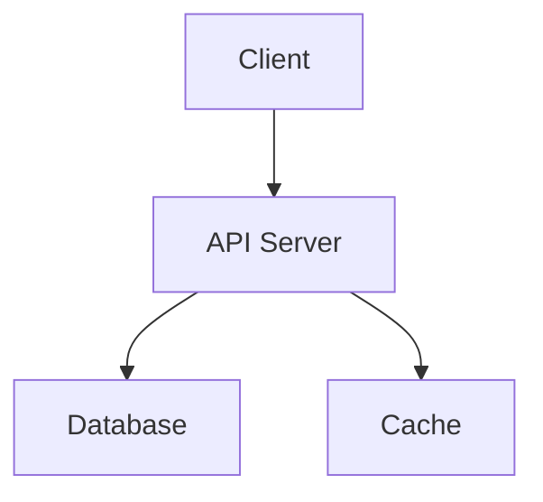

# Architecture

This is a sample reference page. Use this space to document the project's architecture, design decisions, and technical details.

## System Overview

Describe the high-level architecture of the system.

## Components

### Component 1

Description of the component, its responsibilities, and interactions.

### Component 2

Description of another component.

## Data Flow

Explain how data flows through the system.

## Technology Choices

Explain why specific technologies were chosen.

## Diagrams

You can include diagrams using Mermaid:

