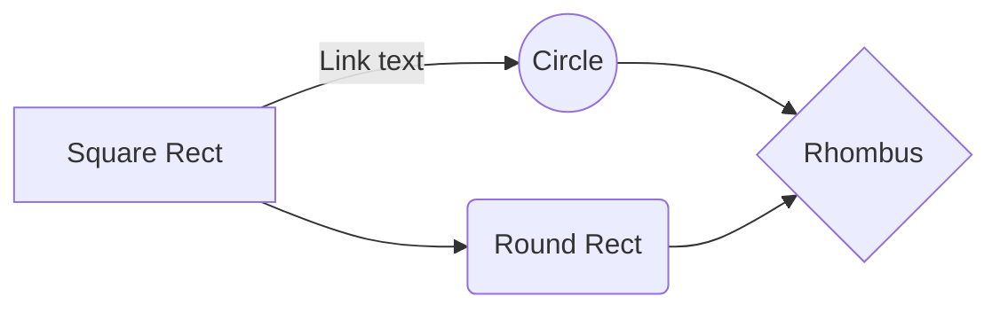
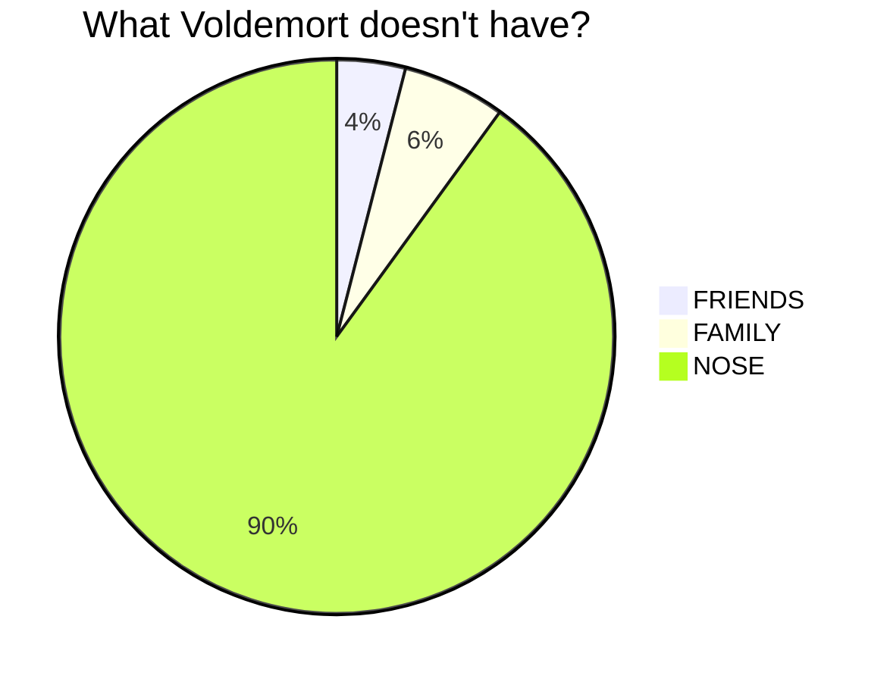
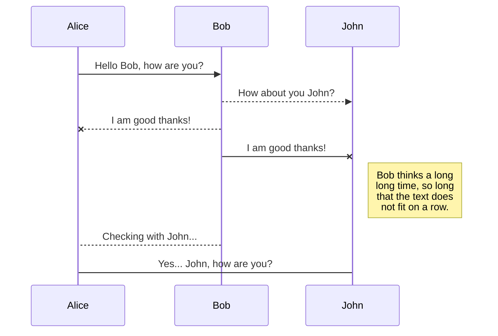
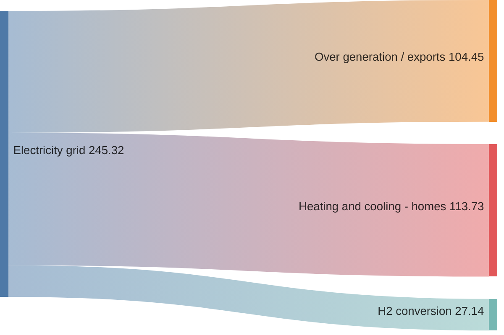
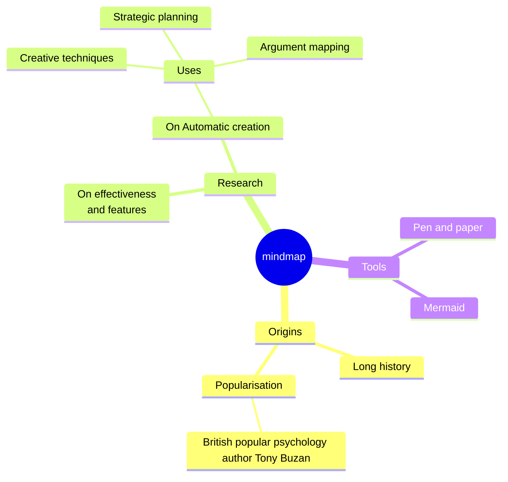

# Design Reference

I use this page to test how markdown and various page features are rendered in my site's active design. I've tried to make use of all the features I rely on and some additional oddities that come from other places where I use the source content of this site (such as my internal notes).

We get our H1 tag for free, though I should be sure that the top level item isn't double rendered and should probably have some kind of lint to make sure there is exactly one top level heading. This does go against the common markdown lint spec but I like my documents to have an independent title from the metadata and not be precisely bound to the name of the file (which to me is more of a slug for the document than a title).

## H2

Second level section with some arbitrary text.

### H3

Down the rabbit hole we go, into the third level of my mind.

#### H4

Surely four levels is enough!? How deep are you going to go?

##### H5

Beyond the pale, into the fifth level of hell.

###### H6

Here there be dragons, the sixth level of the abyss.

## Basic Formatting

* **Bold Text** __two ways__
* *Italic Text* _two ways_
* some `inline code` in the middle of sentence
* a ~~strike through~~ example
* some ==highlighted text== that may not work
* A simple molecule using subscript H~2~O
* A little equation using superscript 2^10^ though I should use [mathjax](#mathjax) for that.

> blockquote text with some *italic* and **bold** text

## Lists

1. First ordered list item
2. Another item
    * Unordered sub-list.
3. And another item.
    1. Ordered sub-list

    indented paragraphs within list items. Note the blank line above, and the leading spaces.
4. One more item

* Unordered list
* with a couple elements

## Links

[inline-style link](https://www.google.com)

[inline link with title](https://stelfox.net "My Homepage")

[arbitrary link as reference text][Arbitrary case-insensitive reference text]

[relative reference to a repository file](./about.md)

[Numbers for reference-style link definitions][1]

use the [link text itself]

Intermediate text as placeholder after links before references.

And a footnote [^1] for good measure.

[arbitrary case-insensitive reference text]: https://stelfox.net/
[1]: https://stelfox.net/about/
[link text itself]: https://stelfox.net/notes/
[^1]: This is the footnote.

## Images

Inline-style:


Reference-style:

![alt text][logo]

[logo]: /logo.png "Logo Title Text 2"

## Code and Syntax Highlighting

Inline `code` with some extra text

```rust
fn main {
  println!("rust syntax highlighting");
}
```

```javascript
var s = "JavaScript syntax highlighting";
alert(s);
```

```python
s = "Python syntax highlighting"
print s
```

```
No language indicated, so no syntax highlighting in Markdown Here.
But let's throw in a <b>tag</b> to see how HTML is treated.
```

## Tables

| Tables        | Are           | Cool     |
| ------------- |:-------------:| --------:|
| col 3 is      | right-aligned | \\$1600  |
| col 2 is      | centered      |   \\$12  |
| zebra stripes | are neat      |    \\$1  |
| *Still*         | renders       | **nicely**   |
| 1             | 2             | 3        |

## Blockquotes

> Blockquotes are very handy in email to emulate reply text.
> This line is part of the same quote.

Quote break.

> This is a very long line that will still be quoted properly when it wraps. Oh boy let's keep writing to make sure this is long enough to actually wrap for everyone. Oh, you can *put* **Markdown** into a blockquote.

Obsidian aside:

> [!Note]
> I use these in my notes mostly as asides, it would be nice to render these alongside the main content.

## Horizontal Rule

As above...

---


...so below.

## Beyond Markdown

### Definition Lists

The pure HTML form gets stripped out, but the extended syntax form works. I'll need to update some internal notes to this syntax aand make it work in my other systems.

Term
: with a definition following it

### Embedded YouTube Videos

They can't be added directly but you can add an image with a link to the video like this:

```no-highlight
<a href="http://www.youtube.com/watch?feature=player_embedded&v=YOUTUBE_VIDEO_ID_HERE
" target="_blank"></a>
```

Or, in pure Markdown, but losing the image sizing and border:

```no-highlight
[](http://www.youtube.com/watch?v=YOUTUBE_VIDEO_ID_HERE)
```

### Mathjax

$$x = {-b \pm \sqrt{b^2-4ac} \over 2a}.$$

### Mermaid Diagrams

Basic flowchart:



Basic pie chart:



Basic sequence diagram:



Sankey:



Mindmap:



### Task List

* [x] Complete building a design reference content page
* [ ] Clean up all my outstanding notes for publication
* [ ] Profit

### Emoji Reference

A more complete list [can be found](https://github.com/ikatyang/emoji-cheat-sheet/) but these are emojis I'm likely to want to quickly look up:

* sweat_smile: :sweat_smile:
* rofl: :rofl:
* upside_down_face: :upside_down_face:
* smiling_face_with_three_hearts: :smiling_face_with_three_hearts:
* heart_eyes: :heart_eyes:
* kissing_heart: :kissing_heart:
* stuck_out_tongue_winking_eye: :stuck_out_tongue_winking_eye:
* thinking: :thinking:
* raised_eyebrow: :raised_eyebrow:
* grimacing: :grimacing:
* exploding_head: :exploding_head:
* open_mouth: :open_mouth:
* cry: :cry:
* astonished: :astonished:
* skull_and_crossbones: :skull_and_crossbones:
* ghost: :ghost:
* see_no_evil: :see_no_evil:
* hear_no_evil: :hear_no_evil:
* speak_no_evil: :speak_no_evil:
* heart: :heart
* 100: :100:
* ok_hand: :ok_hand:
* point_up: :point_up:
* +1: :+1:
* eyes: :eyes:
* muscle: :muscle:
* brain: :brain:
* footprints: :footprints:
* sunflower: :sunflower:
* cheese: :cheese:
* crab: :crab:
* rocket: :rocket:
* airplane: :airplane:
* sunny: :sunny:
* cresent_moon: :cresent_moon:
* rainbow: :rainbow:
* zap: :zap:
* fire: :fire:
* godmode: :godmode:
